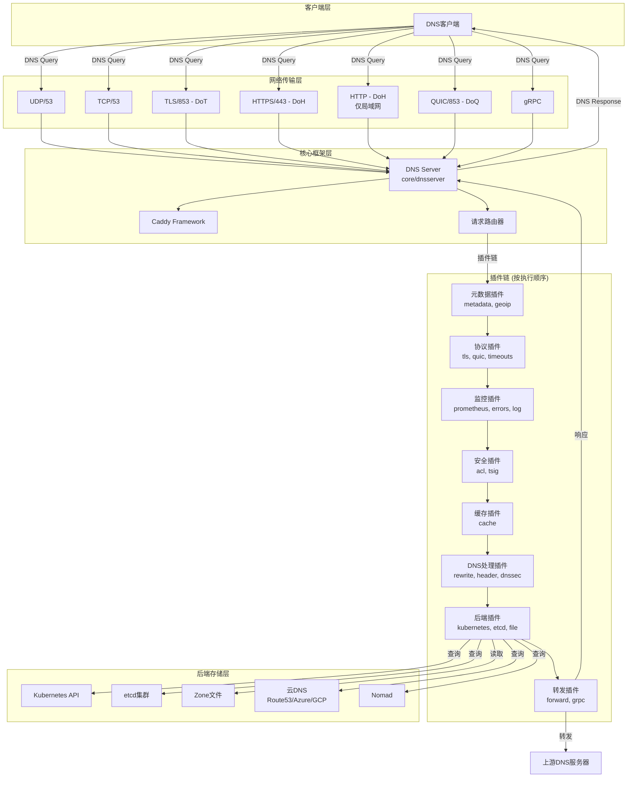
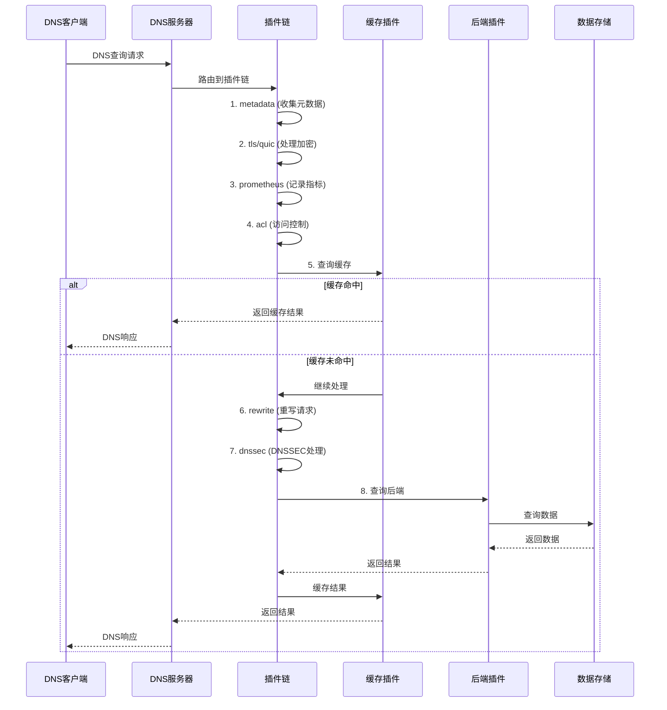

# CoreDNS 项目快速参考

## 技术栈

- **语言**: Go 1.24.0+
- **核心框架**: Caddy (插件系统) + miekg/dns (DNS协议)
- **关键集成**: Kubernetes, etcd, AWS/Azure/GCP, Prometheus

## 架构

**插件链架构**: 单一二进制，DNS请求按顺序经过插件链处理



### 请求处理流程



## 配置文件

**Corefile** - 主配置文件 (类Caddy语法):
```corefile
. :53 {
    errors
    cache 30
    forward . 8.8.8.8
}
```

### DoH (DNS-over-HTTPS) 配置

**使用HTTPS (推荐用于生产环境)**:
```corefile
https://.:443 {
    tls cert.pem key.pem
    forward . 8.8.8.8
}
```

**使用HTTP (仅用于局域网/内部网络，不安全)**:
```corefile
https://.:8053 {
    tls {
        allow_http_doh
    }
    forward . 8.8.8.8
}
```

> ⚠️ **安全警告**: `allow_http_doh` 选项允许DoH服务器使用普通HTTP而非HTTPS。这会导致DNS流量未加密传输。**仅应在受信任的局域网环境中使用**，不要在公网上使用！

**测试HTTP DoH**:
```bash
# 启动服务器
./coredns -conf Corefile.http-doh

# 使用Python测试脚本
./test-http-doh.py

# 或使用curl
echo "AAABAAABAAAAAAAAB2V4YW1wbGUDY29tAAABAAE=" | base64 -d > query.bin
curl -H "Content-Type: application/dns-message" --data-binary @query.bin http://localhost:8053/dns-query
```

详细文档请参阅 [HTTP-DOH-README.md](HTTP-DOH-README.md)

**plugin.cfg** - 定义插件编译顺序，严格按序执行

## 目录结构

```
/workspaces/coredns/
├── coredns.go                 # 主入口文件
├── go.mod                     # Go依赖管理
├── plugin.cfg                 # 插件配置文件
├── Makefile                   # 构建脚本
├── Dockerfile                 # Docker镜像构建
│
├── core/                      # 核心框架
│   ├── coredns.go            # 核心插件注册
│   ├── dnsserver/            # DNS服务器实现
│   │   ├── server.go         # 主服务器逻辑
│   │   ├── server_quic.go    # QUIC服务器
│   │   ├── server_https3.go  # HTTP/3服务器
│   │   ├── https.go          # DoH支持
│   │   └── register.go       # Caddy集成
│   └── plugin/               # 核心插件注册
│
├── coremain/                  # 主程序逻辑
│   ├── run.go                # 启动逻辑
│   ├── run_test.go           # 测试
│   └── version.go            # 版本信息
│
├── plugin/                    # 所有插件实现 (70+个)
│   ├── plugin.go             # 插件接口定义
│   ├── register.go           # 插件注册机制
│   │
│   ├── cache/                # 缓存插件
│   │   ├── cache.go          # 缓存主逻辑
│   │   ├── setup.go          # 配置解析
│   │   └── handler.go        # DNS处理
│   │
│   ├── kubernetes/           # Kubernetes后端
│   │   ├── kubernetes.go     # 主逻辑
│   │   ├── controller.go     # K8s控制器
│   │   ├── handler.go        # DNS解析
│   │   └── object/           # K8s对象
│   │
│   ├── forward/              # DNS转发
│   │   ├── forward.go        # 转发逻辑
│   │   ├── proxy.go          # 代理实现
│   │   └── setup.go          # 配置
│   │
│   ├── etcd/                 # etcd后端
│   ├── file/                 # Zone文件
│   ├── auto/                 # 自动重载
│   ├── route53/              # AWS Route53
│   ├── azure/                # Azure DNS
│   ├── clouddns/             # Google Cloud DNS
│   ├── grpc/                 # gRPC支持
│   ├── dnssec/               # DNSSEC签名
│   ├── rewrite/              # 请求重写
│   ├── hosts/                # hosts文件
│   ├── metrics/              # Prometheus指标
│   ├── health/               # 健康检查
│   ├── ready/                # 就绪检查
│   ├── log/                  # 日志记录
│   ├── errors/               # 错误处理
│   ├── trace/                # 分布式追踪
│   ├── acl/                  # 访问控制
│   ├── tls/                  # TLS加密
│   ├── quic/                 # QUIC协议
│   ├── dns64/                # DNS64转换
│   ├── geoip/                # 地理位置
│   └── pkg/                  # 插件共享库
│       ├── cache/            # 缓存工具
│       ├── proxy/            # 代理工具
│       ├── log/              # 日志工具
│       └── dnsutil/          # DNS工具
│
├── request/                   # DNS请求处理
│   └── request.go            # 请求对象封装
│
├── pb/                        # Protocol Buffer定义
│   └── dnstap/               # dnstap协议
│
├── test/                      # 集成测试
│   ├── file_test.go          # 文件测试
│   └── k8sapi/               # K8s API mock
│
├── man/                       # 手册页
│   ├── coredns.1             # CoreDNS手册
│   └── coredns-*.7           # 各插件手册
│
├── notes/                     # 发布说明
│   └── coredns-*.md          # 版本更新日志
│
└── coredns-https/            # HTTPS插件 (外部)
    ├── https.go
    ├── proxy.go
    └── setup.go
```

### 5.2 核心模块功能说明

#### 顶层文件
| 文件/目录 | 功能 |
|-----------|------|
| `coredns.go` | 程序入口，调用coremain.Run() |
| `go.mod` | Go模块依赖管理 |
| `plugin.cfg` | 插件编译配置 |
| `Makefile` | 构建、测试、发布脚本 |
| `Dockerfile` | Docker镜像构建 |
| `README.md` | 项目说明文档 |

#### core/ - 核心框架
| 子目录/文件 | 功能 |
|------------|------|
| `core/coredns.go` | 导入并注册dnsserver包 |
| `core/dnsserver/` | DNS服务器核心实现 |
| `core/dnsserver/server.go` | Server结构体，管理DNS监听器 |
| `core/dnsserver/register.go` | 注册为Caddy ServerType |
| `core/dnsserver/server_quic.go` | DoQ (DNS over QUIC) 服务器 |
| `core/dnsserver/server_https3.go` | DoH3 (DNS over HTTP/3) 服务器 |
| `core/plugin/` | 核心插件自动注册 |

#### coremain/ - 主程序
| 文件 | 功能 |
|------|------|
| `run.go` | Run()函数: 解析命令行、加载配置、启动服务器 |
| `version.go` | 版本信息管理 |
| `run_test.go` | 启动流程测试 |

#### plugin/ - 插件系统
| 核心文件 | 功能 |
|----------|------|
| `plugin.go` | Handler接口定义 |
| `register.go` | 插件注册机制 |
| `backend.go` | 后端插件接口 |

#### 关键插件详解

**kubernetes/** - Kubernetes集成
- `kubernetes.go`: 主插件结构，实现Handler接口
- `controller.go`: Watch Kubernetes API，维护服务/端点缓存
- `handler.go`: 将K8s服务解析为DNS记录
- `object/`: K8s对象的内部表示

**forward/** - DNS转发
- `forward.go`: 转发插件主逻辑
- `proxy.go`: 上游连接池管理
- `connect.go`: 建立上游连接
- `setup.go`: 解析Corefile配置

**cache/** - DNS缓存
- `cache.go`: 缓存插件，维护正向/负向缓存
- `handler.go`: 缓存查询和存储逻辑
- `setup.go`: 缓存配置解析

**file/** - Zone文件
- `file.go`: 从文件加载DNS zone
- `zone.go`: Zone数据结构
- `lookup.go`: zone查询

**etcd/** - etcd后端
- `etcd.go`: etcd客户端封装
- `lookup.go`: 从etcd查询DNS记录

**metrics/** - 监控
- `metrics.go`: Prometheus指标定义
- `vars/`: 指标变量

### 5.3 关键文件定位

#### 5.3.1 入口文件
**主入口**: `/workspaces/coredns/coredns.go`
```go
package main

import (
    _ "github.com/coredns/coredns/core/plugin"
    "github.com/coredns/coredns/coremain"
)

func main() {
    coremain.Run()
}
```

**启动逻辑**: `/workspaces/coredns/coremain/run.go`
- 解析命令行参数
- 加载Corefile配置
- 初始化插件链
- 启动DNS服务器

#### 5.3.2 主要配置文件
| 文件路径 | 类型 | 用途 |
|----------|------|------|
| `Corefile` | 运行时配置 | DNS服务器配置 (运行时创建) |
| `plugin.cfg` | 编译配置 | 插件顺序和包路径 |
| `go.mod` | 依赖配置 | Go模块依赖 |
| `Makefile` | 构建配置 | 编译和测试脚本 |

#### 5.3.3 核心业务逻辑

**DNS服务器核心**
- `/workspaces/coredns/core/dnsserver/server.go`
  - Server结构体定义
  - ServeDNS方法 (DNS请求处理入口)
  - 插件链执行逻辑

**插件接口定义**
- `/workspaces/coredns/plugin/plugin.go`
  - Handler接口
  - Plugin类型
  - NextOrFailure助手函数

**请求处理**
- `/workspaces/coredns/request/request.go`
  - Request结构体
  - 封装DNS查询信息

**关键业务插件位置**

| 业务功能 | 核心文件 |
|----------|----------|
| Kubernetes服务发现 | `/workspaces/coredns/plugin/kubernetes/kubernetes.go` |
| DNS缓存 | `/workspaces/coredns/plugin/cache/cache.go` |
| DNS转发 | `/workspaces/coredns/plugin/forward/forward.go` |
| Zone文件解析 | `/workspaces/coredns/plugin/file/file.go` |
| etcd后端 | `/workspaces/coredns/plugin/etcd/etcd.go` |
| AWS Route53 | `/workspaces/coredns/plugin/route53/route53.go` |
| 监控指标 | `/workspaces/coredns/plugin/metrics/metrics.go` |
| 健康检查 | `/workspaces/coredns/plugin/health/health.go` |
| 日志记录 | `/workspaces/coredns/plugin/log/log.go` |
| DNSSEC | `/workspaces/coredns/plugin/dnssec/dnssec.go` |
| gRPC支持 | `/workspaces/coredns/plugin/grpc/grpc.go` |

#### 5.3.4 测试文件
| 测试类型 | 位置 |
|----------|------|
| 单元测试 | 各插件目录下的 `*_test.go` |
| 集成测试 | `/workspaces/coredns/test/` |
| 插件测试工具 | `/workspaces/coredns/plugin/test/` |

---

## 六、总结

coredns/
├── coredns.go              # 入口: main() -> coremain.Run()
├── plugin.cfg              # 插件编译顺序配置
├── go.mod                  # 依赖管理
│
├── core/
│   ├── dnsserver/          # DNS服务器实现
│   │   └── server.go       # Server.ServeDNS() - 核心请求处理
│   └── plugin/             # 插件自动注册
│
├── coremain/
│   └── run.go              # 启动逻辑: 解析配置、初始化插件链
│
├── plugin/                 # 70+ 插件
│   ├── plugin.go           # Handler接口定义
│   ├── kubernetes/         # K8s服务发现
│   ├── forward/            # DNS转发
│   ├── https/              # DNS over HTTPS (DoH)
│   ├── cache/              # DNS缓存
│   ├── file/               # Zone文件
│   ├── etcd/               # etcd后端
│   ├── metrics/            # Prometheus
│   └── pkg/                # 插件共享库
│
└── request/                # DNS请求封装
```

## 关键文件

| 文件 | 用途 |
|------|------|
| `coredns.go` | 主入口 |
| `coremain/run.go` | 启动逻辑 |
| `plugin.cfg` | 插件顺序 (严格按序执行) |
| `core/dnsserver/server.go` | Server.ServeDNS() - 核心处理 |
| `plugin/plugin.go` | Handler接口 |

## 开发要点

- **添加插件**: 在 `plugin/` 创建目录 → 实现Handler接口 → 更新 `plugin.cfg` → `go generate`
- **插件顺序**: plugin.cfg 中的顺序决定执行顺序，严格遵守
- **构建**: `make` 或 `go build`
- **测试**: `go test ./...`